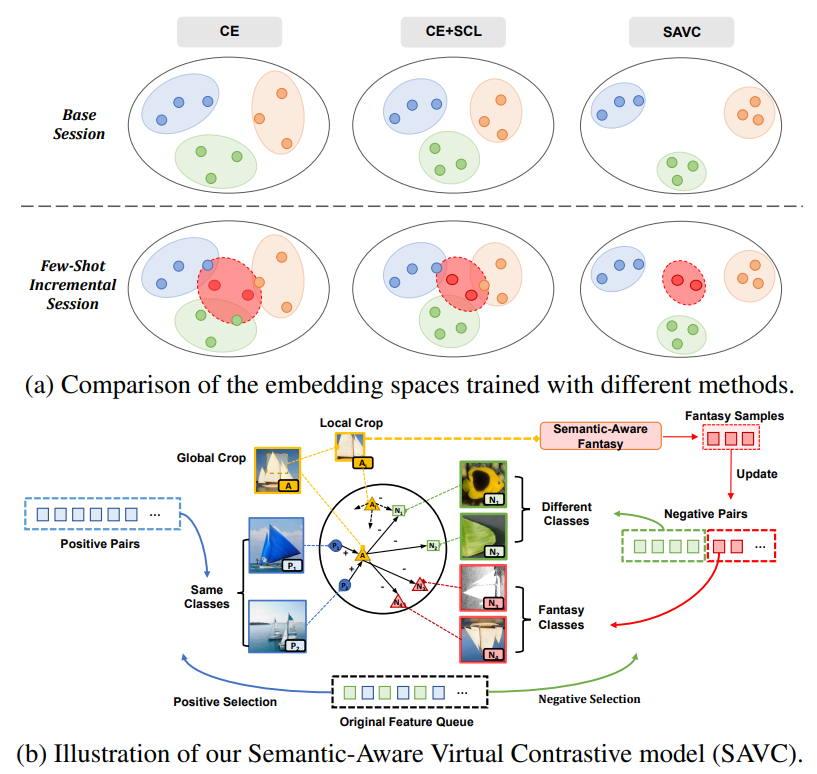
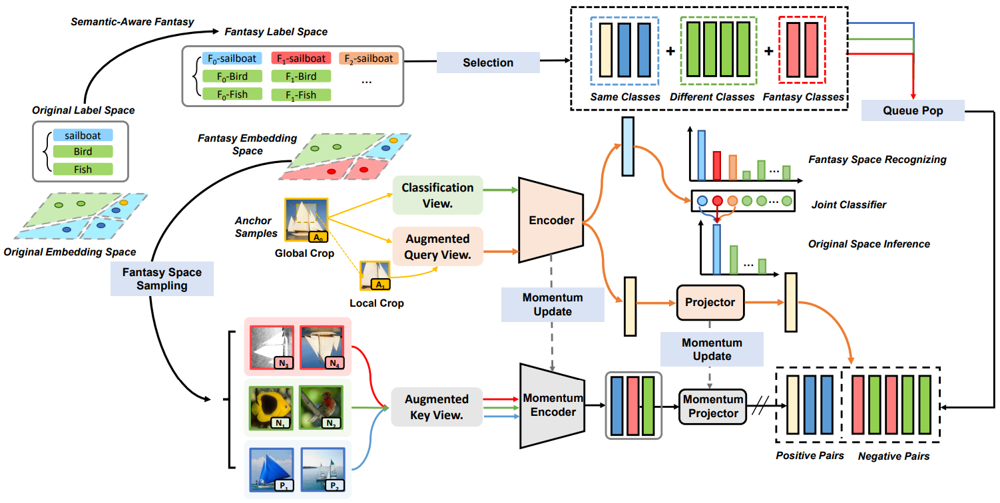
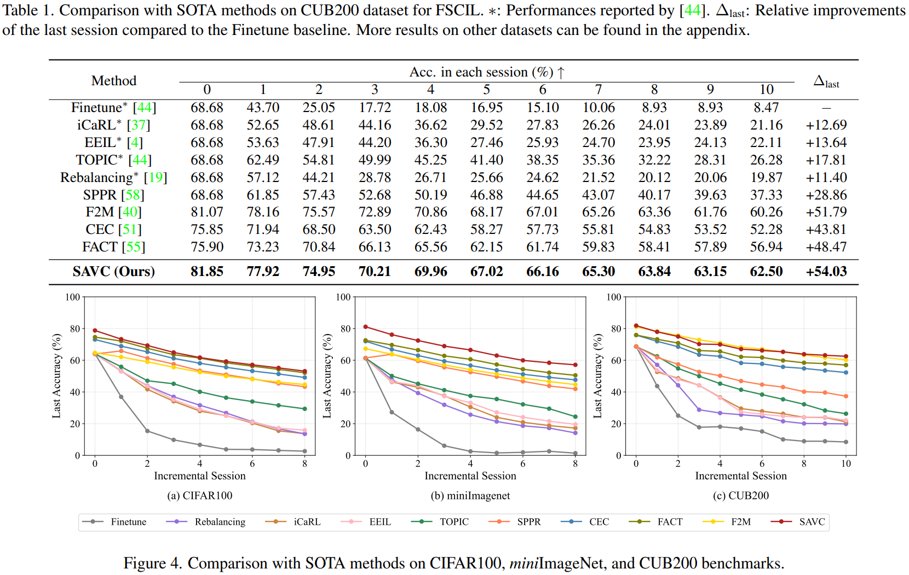

# SAVC
The implementation of CVPR 2023 paper Learning with Fantasy: Semantic-Aware Virtual Contrastive Constraint for Few-Shot Class-Incremental Learning [[paper]](https://arxiv.org/abs/2304.00426).
If you use the code in this repo for your work, please cite the following bib entries:

```
@inproceedings{song2023learning,
  title={Learning with Fantasy: Semantic-Aware Virtual Contrastive Constraint for Few-Shot Class-Incremental Learning},
  author={Song, Zeyin and Zhao, Yifan and Shi, Yujun and Peng, Peixi and Yuan, Li and Tian, Yonghong},
  booktitle={Proceedings of the IEEE/CVF Conference on Computer Vision and Pattern Recognition},
  pages={24183--24192},
  year={2023}
}
```
## Abstract
Few-shot class-incremental learning (FSCIL) aims at learning to classify new classes continually from limited samples without forgetting the old classes. The mainstream framework tackling FSCIL is first to adopt the cross-entropy (CE) loss for training at the base session, then freeze the feature extractor to adapt to new classes.
However, in this work, we find that the CE loss is not ideal for the base session training as it suffers poor class separation in terms of representations, which further degrades generalization to novel classes. One tempting method to mitigate this problem is to apply an additional naive supervised contrastive learning (SCL) in the base session. Unfortunately, we find that although SCL can create a slightly better representation separation among different base classes, it still struggles to separate base classes and new classes. Inspired by the observations made, we propose Semantic-Aware Virtual Contrastive model (SAVC), a novel method that facilitates separation between new classes and base classes by introducing virtual classes to SCL. These virtual classes, which are generated via pre-defined transformations, not only act as placeholders for unseen classes in the representation space, but also provide diverse semantic information. By learning to recognize and contrast in the fantasy space fostered by virtual classes, our SAVC significantly boosts base class separation and novel class generalization, achieving new state-of-the-art performance on the three widely-used FSCIL benchmark datasets.



## Pipline
The whole learning pipline of our model:



## Results


Please refer to our [paper](https://arxiv.org/abs/2304.00426) for detailed values.

## Requirements
- [PyTorch >= version 1.1 and torchvision](https://pytorch.org)
- tqdm

## Datasets
We provide the source code on three benchmark datasets, i.e., CIFAR100, CUB200 and miniImageNet. Please follow the guidelines in [CEC](https://github.com/icoz69/CEC-CVPR2021) to prepare them.

## Code Structures
There are five parts in the code.
 - `models`: It contains the backbone network and training protocols for the experiment.
 - `data`: Images and splits for the data sets.
- `dataloader`: Dataloader of different datasets.
 - `augmentations`: The contrastive augmentations and fantasy methods used in SAVC.
 - `losses`: The supervised contrastive loss.
 
## Training scripts

- CIFAR100

  ```
  python train.py -project savc -dataset cifar100 -base_mode 'ft_cos' -new_mode 'avg_cos' -lr_base 0.1 -lr_new 0.001 -decay 0.0005 -epochs_base 600 -schedule Cosine -gpu 0 -temperature 16 -moco_dim 32 -moco_k 8192 -mlp -moco_t 0.07 -moco_m 0.995 -size_crops 32 18 -min_scale_crops 0.9 0.2 -max_scale_crops 1.0 0.7 -num_crops 2 4 -alpha 0.2 -beta 0.8 -constrained_cropping -fantasy rotation2
  ```
  
- CUB200
    ```
    python train.py -project savc -dataset cub200 -base_mode 'ft_cos' -new_mode 'avg_cos' -gamma 0.1 -lr_base 0.002 -lr_new 0.000005 -decay 0.0005 -epochs_base 120 -schedule Milestone -milestones 60 80 100  -gpu '0' -temperature 16 -moco_dim 128 -moco_k 8192 -mlp -moco_t 0.07 -moco_m 0.999 -size_crops 224 96 -min_scale_crops 0.2 0.05 -max_scale_crops 1.0 0.14 -num_crops 2 4 -constrained_cropping -alpha 0.2 -beta 0.8 -fantasy rotation2 
    ```

- miniImageNet
    ```
    python train.py -project savc -dataset mini_imagenet -base_mode 'ft_cos' -new_mode 'avg_cos' -gamma 0.1 -lr_base 0.1 -lr_new 0.1 -decay 0.0005 -epochs_base 120 -schedule Milestone -milestones 40 70 100  -gpu '0' -temperature 16 -moco_dim 128 -moco_k 8192 -mlp -moco_t 0.07 -moco_m 0.999 -size_crops 84 50 -min_scale_crops 0.2 0.05 -max_scale_crops 1.0 0.14 -num_crops 2 4 -constrained_cropping -alpha 0.2 -beta 0.8 -fantasy rot_color_perm12  
    ```

Remember to change `YOURDATAROOT` into your own data root. If you want to use incremental finetuning, set `-incft`. 

## Acknowledgment
We thank the following repos providing helpful components/functions in our work.

- [CEC](https://github.com/icoz69/CEC-CVPR2021)
- [SLA](https://github.com/hankook/SLA)
- [Revisiting-Contrastive-SSL](https://github.com/wvangansbeke/Revisiting-Contrastive-SSL)
- [unimoco](https://github.com/dddzg/unimoco)

## Contact
If there are any questions, please feel free to contact with the author: Zeyin Song (zysong@stu.pku.edu.cn). 
